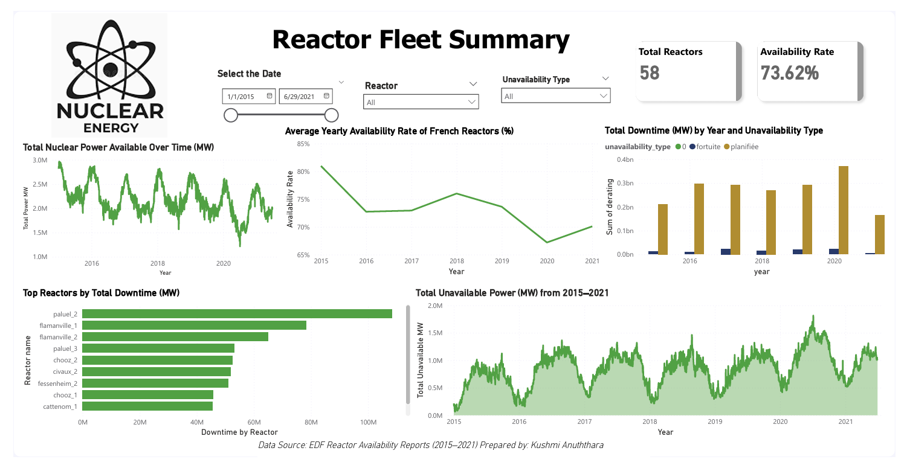
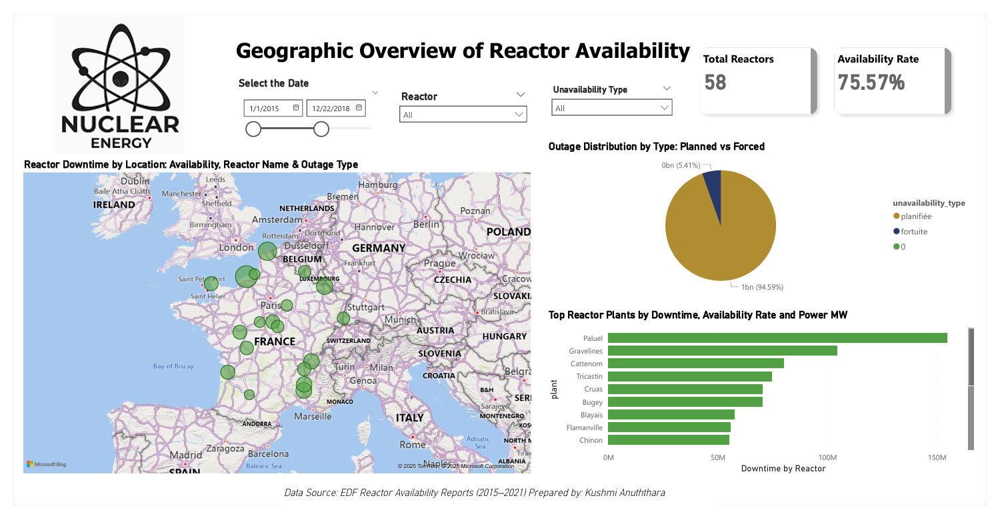
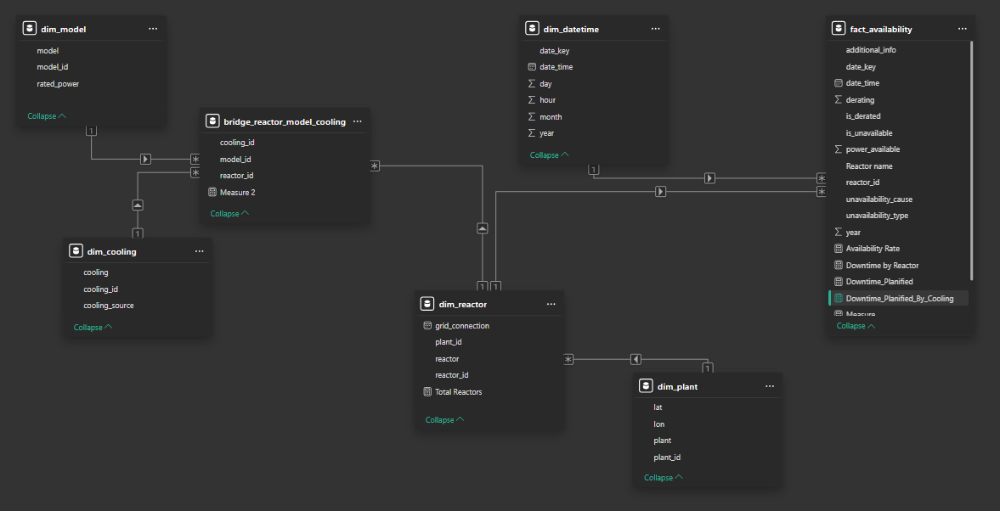

# Azure to Power BI Project: French Nuclear Reactor Availability (2015–2021)

## Project Overview

This project demonstrates an end-to-end **data engineering pipeline** developed as part of an internship and tailored for a **data engineering opportunity at Hitachi Energy**. It covers the ingestion and transformation of raw nuclear reactor availability data in Azure, processing through a **Medallion Architecture (Bronze → Silver → Gold layers)** using Databricks, and culminating in an **interactive Power BI dashboard**.

---

## Goal

To build a scalable data platform that supports:

* Understanding availability of French nuclear reactors (58 units)
* Analyzing downtime causes and energy impact
* Presenting geospatial and time-based insights for stakeholders

---

## Final Dashboard Snapshots

### Fleet Summary Page



### Geographic Overview Page



---

## Dataset Context

Source: EDF France - Reactor Availability Reports (2015–2021)

* 30-minute time resolution
* Power availability, derating values
* Unavailability reasons: Planned ("planifiée") and Forced ("fortuite")

---

## Architecture Flow

```
Azure Blob Storage (CSV Files)
    ↳ Mounted to Databricks with dbutils.fs.mount()
        ↳ Bronze Layer: Raw file ingestion
            ↳ Silver Layer: Cleaned, structured data
                ↳ Gold Layer: Star schema (fact + dim + bridge)
                    ↳ Power BI: Interactive visuals
```

---

## Storage Layer (Azure Blob)

Files uploaded:

* `french_nuclear_reactors_availability.csv`
* `french_nuclear_reactors_availability_full.csv`
* `french_nuclear_reactors_list.csv`

Mounted using SAS token into `/mnt/frenchnuclear` in Databricks.

---

## Bronze Layer (`Bronze_Layer.py`)

* Mounts storage and ingests CSVs
* Creates raw Delta tables:

  * `bronze.french_nuclear_reactors_list`
  * `bronze.french_nuclear_reactors_availability`
  * `bronze.french_nuclear_reactors_availability_full`

---

## Silver Layer (`Silver_layer.py`)

* Normalizes structure
* Adds a datetime dimension
* Converts key indicators (availability, derating) to clean format
* Outputs structured Silver tables

---

## Gold Layer (`Gold_Layer.py`)

* Creates star schema tables:

  * Dimensions: `dim_plant`, `dim_model`, `dim_cooling`, `dim_datetime`, `dim_reactor`
  * Bridge: `bridge_reactor_model_cooling`
  * Fact: `fact_availability` with power, outage, cause, derating

---

## Power BI Data Model

Here is the complete star-schema model visualized in Power BI:



This model includes:

* Fact table for availability and derating metrics
* Dimensions for time, plant, reactor, cooling system, and model
* Bridge table to handle many-to-many relationships between cooling, model, and reactor

---

## Power BI Dashboard (`KushmiAzure_NuclearProject.pdf`)

### Page 1: Reactor Fleet Summary

* **KPI cards**: Total Reactors (58), Avg Availability Rate (73.6%)
* **Line charts**: Total Power over time, Average availability rate
* **Bar charts**: Downtime (MW) by year and outage type
* **Insight**: Most downtime is **planned maintenance**. Seasonal power variations are visible and 2020 shows sharp availability drop likely due to COVID-era disruptions.

### Page 2: Geographic View

* **Map**: Reactor locations sized by availability impact
* **Donut chart**: Outage split: \~95% planned vs 5% forced
* **Bar chart**: Plants with highest downtime include *Paluel*, *Gravelines*, *Flamanville*

---

## Results Summary

* Built **star-schema model** with 7 tables and bridge logic
* **Visualized outage types geographically** and by time
* Enabled **reactor-level filtering**, seasonality detection
* Availability dropped sharply in **2020**, potentially linked to global disruptions

---

## Technologies Used

| Tool               | Purpose                                         |
| ------------------ | ----------------------------------------------- |
| Azure Blob Storage | Raw data lake                                   |
| Azure Databricks   | Data cleaning, Lakehouse modeling               |
| Delta Tables       | Medallion Architecture (Bronze → Silver → Gold) |
| Power BI           | Dashboard & storytelling                        |
| PySpark            | All transformations and ETL logic               |

---

## Timeline

* Project duration: \~3 weeks
* Internship outcome
* Designed to target roles at **Hitachi Energy**

---

## Author

**Kushmi Anuththara**
Master's in Data Science | Azure + Power BI + Databricks Enthusiast

---

## Repository Structure

```
azure-nuclear-power-bi-pipeline/
|
|├️ Bronze_Layer.py
|├️ Silver_layer.py
|├️ Gold_Layer.py
|├️ KushmiAzure_NuclearProject.pdf
|├️ Nimg1.png     ← Dashboard page 1
|├️ Nimg2.png     ← Dashboard page 2
|├️ model.png     ← Star schema model diagram
|└️ README.md
```

---

## Connect

* [LinkedIn](https://www.linkedin.com/in/kushmi-anuththara-chandrasena-04b741113/)
* [Portfolio](https://github.com/kushitec15691)

If you're a recruiter or hiring manager looking for someone with **Azure, Databricks, and dashboarding experience**, feel free to reach out!
